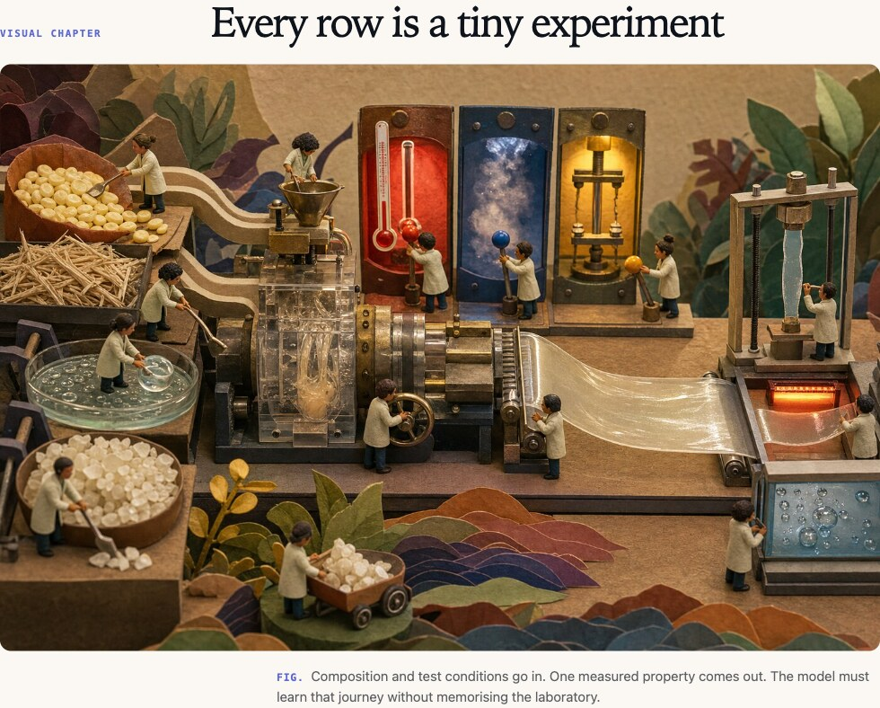

# Plot.md

> Make technical Markdown read like a story.

[](https://github.com/paipeline/plot-md/actions/workflows/ci.yml)
[](LICENSE)
[](https://code.visualstudio.com/)

Plot.md is a semantic renderer and agent Skill for technical documents. Agents keep writing compact, diff-friendly Markdown; Plot.md turns selected blocks into visual chapters, memes, decisions, reveals, and checkpoints inside VS Code's built-in Markdown Preview.



The goal is simple: make an agent document as easy to follow as a good story—without generating a giant HTML artifact or hiding the source behind a proprietary format.

Version 0.0.5 deep-renders nine reusable semantic shapes:

- `smd-decision` for choices, comparisons, and records
- `smd-flow` for ordered processes and input-to-output equations
- `smd-matrix` for tiered feature contracts and dense reference tables
- `smd-meme` for local-image jokes with editable Markdown punchlines
- `smd-note` for critical rules, insights, and cautions
- `smd-hook` for a story-sized opening question
- `smd-visual` for a local hero image, explanatory scene, or visual contrast
- `smd-reveal` for an evidence-earned change in interpretation
- `smd-checkpoint` for a compact end-of-chapter memory aid

It deliberately does not load workspace CSS, JavaScript, remote resources, React components, or arbitrary layout expressions.

## Why Plot.md?

HTML gives agents unlimited layout freedom, but it is expensive to generate and difficult to diff. Plain Markdown is efficient, but long technical documents become visually repetitive.

Plot.md keeps the source small:

```text
technical Markdown + semantic intent → safe reusable template
```

The renderer owns presentation. The document only says what a block means.

## Install

Download the latest `.vsix` from [GitHub Releases](https://github.com/paipeline/plot-md/releases), then run:

```bash
code --install-extension plot-md-0.0.5.vsix
```

Or build it locally:

```bash
npm install
npm run check
npm run package
```

Install the generated `.vsix`, open a single local workspace, then run:

1. `Plot.md: Initialize Project`
2. Open `examples/AGENTS.md`
3. `Plot.md: Validate Current File`
4. `Plot.md: Open Preview`

Use this syntax in any `.md` file:

```md
:::smd-decision id="preview-engine" status="accepted" variant="comparison"
## Preview engine

| Option | Strength | Weakness |
|---|---|---|
| Built-in Preview | Native workflow | Less control |
| Custom Webview | Full control | More surface to rebuild |

**Outcome:** Extend the built-in preview.
:::
```

The dataset example exercises every bundled template:

```bash
code examples/dataset-feature-guide.md
```

Meme blocks keep the image local and the joke editable:

```md
:::smd-meme title="RANDOM SPLIT: 0.99 R². WE ARE SO BACK." variant="classic"
<!-- Insert exactly one relative local Markdown image. -->

**同一篇论文：** 戴个假胡子，再考一次。
:::
```

Narrative blocks turn a dense guide into a reading journey while keeping the underlying Markdown small:

```md
:::smd-hook title="Did the model learn the science—or recognise the paper?"
Follow the evidence before trusting the score.
:::

:::smd-visual title="One formulation, three representations" variant="scene"
<!-- Insert exactly one relative local Markdown image. -->

These encodings are alternate views of the same formulation.
:::

:::smd-reveal title="The score was a disguise."
Grouped validation reveals the shortcut.
:::

:::smd-checkpoint title="Keep these rules"
1. Split by paper.
2. Preserve test conditions.
3. Start with one compact composition encoding.
:::
```

Without the extension, the markers and inner Markdown stay readable. Invalid or unclosed blocks are never swallowed.

## Safe project customization

`Initialize Project` creates `.semantic-markdown/templates.json`. Version 0.0.5 allows:

- `decision.variant`: `summary`, `comparison`, `record`
- `flow.variant`: `steps`, `equation`
- `matrix.variant`: `tiers`, `columns`
- `meme.variant`: `classic`, `poster`, `deadpan`
- `note.tone`: `critical`, `insight`, `caution`
- `visual.variant`: `hero`, `scene`, `split`
- `theme.density`: `compact`, `comfortable`
- `theme.radius`: `small`, `medium`
- `theme.accent`: `lavender`, `amber`, `blue`

Registry updates are validated before replacing the last-known-good snapshot. Because VS Code does not document a public registry-driven Preview refresh command, close and reopen an existing Preview after a template change.

The bundled agent Skills cover both halves of the workflow:

- `customize-semantic-markdown` converts visual requests into safe registry values.
- `storyify-markdown` preserves the source facts while arranging hooks, images, evidence, memes, reveals, and checkpoints into a coherent reading rhythm.

The story Skill follows a strict rule: numbers, formulas, code, citations, limitations, and technical conclusions stay unchanged. Narrative is added around the evidence, never in place of it.

## Architecture

```text
src/core/       directive scanner, registry schema, validation
src/renderer/   fixed safe HTML and markdown-it adapter
src/extension/  VS Code commands, trust, registry snapshots, diagnostics
skills/         agent customization contract
media/          extension-owned static Preview CSS
```

`src/core` and `src/renderer` do not import `vscode`, so protocol and rendering behavior remain unit-testable outside the extension host.

## Prototype boundaries

- One trusted local `file:` workspace folder.
- Nine fixed, safe directive families; unknown directive types report a precise diagnostic.
- Current-file diagnostics support unsaved buffers.
- No automatic Preview refresh after registry-only changes.
- No telemetry and no network access.

The two API conclusions are recorded in `docs/spikes/vscode-preview-spikes.md` in the source repository.

## Contributing

Issues, new safe template proposals, accessibility improvements, and renderer tests are welcome. Read [CONTRIBUTING.md](CONTRIBUTING.md) before opening a pull request.

Plot.md is released under the [MIT License](LICENSE).
